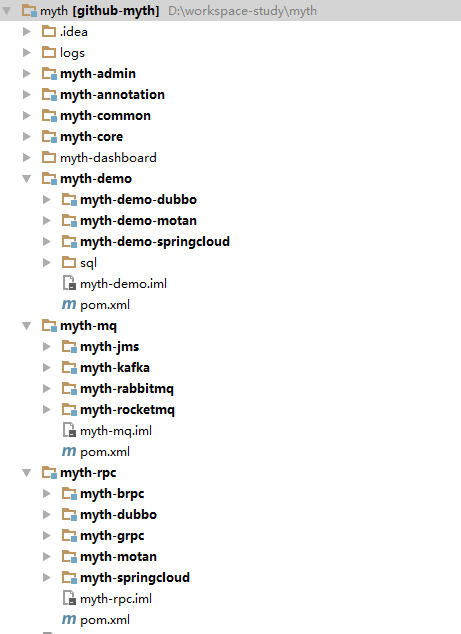

# Myth源码解析系列之（二）-项目结构介绍

 上一篇我们了解了myth是什么及能做什么，下面我们来了解下项目主体结构吧

## 项目工程结构图

## 项目工程详解

* <b>myth-annotation</b> myth分布式事务框架注解(如 @myth注解),业务层主要通过该注解标记来实现分布式事务功能，dubbo, motan等rpc框架需要依赖此工程，为公共基础工程。

* <b>myth-common</b>  一个公共项目，里面主要是一些配置，枚举，异常定义等。

* <b>myth-core</b> 该项目是myth框架的核心实现，包括服务的启动，调用流程，aop切面，重试机制等实现。

* <b>myth-rpc</b> 该项目是对主流rpc框架的支持，包括dubbo、motan、springcloud。

* <b>myth-dubbo</b> 该项目是对dubbo框架的支持，里面主要针对dubbo的特性的实现。

* <b>myth-springcloud</b> 该项目是对springcloud框架的支持，里面主要针对springcloud的特性的实现。

* <b>myth-motan</b> 该项目是对motan框架的支持，里面主要针对motan的特性的实现。

* <b>myth-brpc</b> 未完待续。。。

* <b>myth-grpc</b> 未完待续。。。

* <b>myth-mq</b> ，主要对主流MQ系列框架的支持，包括activeMq, kafka, rabbitmq, rocketmq 。

* <b>myth-jms</b> 该项目是对消息中间件activemq的支持，里面主要针对activemq的特性的实现。

* <b>myth-kafka</b> 该项目是对消息中间件kafka的支持，里面主要针对kafka的特性的实现。

* <b>myth-rabbitmq</b> 该项目是对消息中间件rabbitmq的支持，里面主要针对rabbitmq的特性的实现。

* <b>myth-rocketmq</b> 该项目是对消息中间件rocketmq的支持，里面主要针对rocketmq的特性的实现。

* <b>myth-demo</b> 这是实战体验的demo项目，里面有针对dubbo用户、motan用户、springcloud用户的案列，里面具体的配置，用户可以参考 myth-demo-dubbo、 myth-demo-springcloud 以及 myth-demo-motan 。

* <b>myth-dashboard</b> 该项目是分布式事务管理后台的前端源码，采用vue.js + element UI 实现

* <b>myth-admin</b> 该项目是分布式事务的跟踪管理后台（调用链跟踪，控制补偿事务等功能）

<b>大家有任何问题或者建议欢迎沟通 ，欢迎加入QQ群：162614487 进行交流</b>
