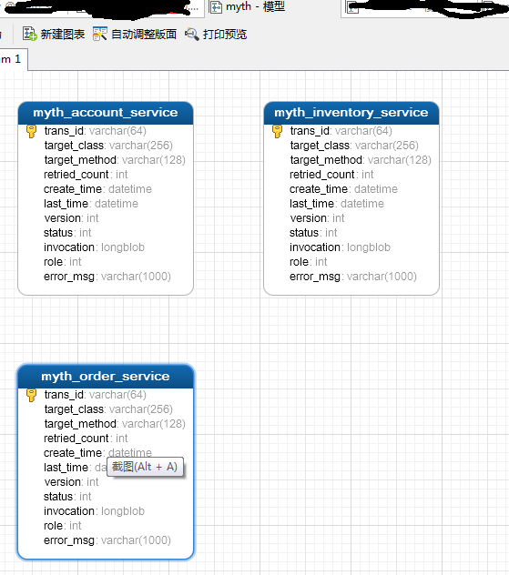

# Myth源码解析系列之（三）- 环境搭建

## 环境搭建教程

在上一篇中，我们了解了项目的整体结构，以及每个模块大概的作用，现在我们来开始搭建项目整个环境~~

### 本地环境要求（这里事务消息存储为mysql，消息中间件为：rocketmq）
JDK：1.8+
需安装 git 、 maven  、 mysql 、 rocketmq

#### 1、pull项目源代码
git clone  https://github.com/yu199195/myth.git
maven clean install

#### 2、数据库初始化
脚本地址： myth\myth-demo\sql\myth-mysql-demo.sql
这里使用的mysql客户端工具： navicat premium

主要创建3个数据库：
  1. myth_account 会员服务数据库
  2. myth_order 订单服务数据库
  3. myth_stock 库存服务数据库
  4. myth 分布式事务消息库（手工创建）

  前面3个库大家都很清楚，主要是为了演示分布式事务，在这里选择经典的订单下单这个场景，以便大家快速理解上手。

  这里主要讲解myth库，该库主要存储分布式事务消息，参与分布式事务的各个子系统都对应一张表，用于存储各子系统本地事务消息

   （注意：因为我这里采用的是mysql，所以需要创建这个数据库，只需创建库即可，该库下的表在各子业务子系统启动时自动create，代码解析请见后续章节）

myth库模型


#### 3、rocketmq 安装部署

1. 下载 http://rocketmq.apache.org/dowloading/releases/

    解押：rocketmq-all-4.0.0-incubating-bin-release.zip

2. 修改runservice.sh和runbroker.sh

  JAVA_OPT="${JAVA_OPT} -server -Xms512m -Xmx512m -Xmn256m -XX:PermSize=128m -XX:MaxPermSize=320m"

3. 修改broker.conf

 ```javascript
brokerClusterName = DefaultCluster
brokerName = broker-a
namesrvAddr=192.168.156.101:9876 #rocketmq 安装本机ip地址:服务端口
brokerId = 0
brokerIP1=192.168.156.101 #rocketmq 安装本机ip地址
deleteWhen = 04
fileReservedTime = 48
brokerRole = ASYNC_MASTER
flushDiskType = ASYNC_FLUSH
storePathRootDir=/soft/rocketmq/data  #数据存储路径
storePathCommitLog=/soft/rocketmq/logs  #日志存放路径
```
4 启动 namesrv
nohup sh apache-rocketmq-all/bin/mqnamesrv >logs/namesrv.log 2>&1 &


5 启动broker
nohup sh apache-rocketmq-all/bin/mqbroker -c apache-rocketmq-all/conf/broker.conf  > logs/broker.log 2>&1 &

6.验证
 ```javascript
[root@myyh2 conf]# jps
2930 NamesrvStartup
3508 BrokerStartup
3562 Jps
```
如上表示启动成功！


7.开放服务器端口 ：

/sbin/iptables -I INPUT -p tcp --dport 9876 -j ACCEPT

到此环境搭建基本完成，下一章将进行配置与启动详解~


<b>大家有任何问题或者建议欢迎沟通 ，欢迎加入QQ群：162614487 进行交流</b>
