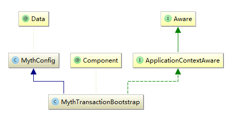

# Myth源码解析系列之（五）- 服务启动源码解析

通过前面几篇文章，我们搭建了环境，也进行了分布式事务服务的体验，相信大家对myth也有了一个大体直观的了解，接下来我们将正式步入源码解析之旅~~

### order服务启动源码解析（myth-demo-springcloud 为例, 分布式事务消息持久化：db方式, mq： rocketmq ）
因为我们demo场景是下单，所以我们首先来看订单项目工程( myth-demo-springcloud-order)，第一步先找到程序入口，我们框架是基于spring，很自然我们会想到<b>applicationContext.xml</b>，请看一下配置，相信大家还有印象~
```xml
     <!--开启扫描Myth分布式框架包-->
    <context:component-scan base-package="com.github.myth.*"/>
    <!--开启动态代理-->
    <aop:aspectj-autoproxy expose-proxy="true"/>

    <!--配置启动类-->
    <bean id="mythTransactionBootstrap" class="com.github.myth.core.bootstrap.MythTransactionBootstrap">
        <property name="repositorySuffix" value="order-service"/>
        <property name="serializer" value="kryo"/>
        <property name="coordinatorQueueMax" value="5000"/>
        <property name="coordinatorThreadMax" value="8"/>
        <property name="rejectPolicy" value="Abort"/>
        <property name="blockingQueueType" value="Linked"/>
        <property name="needRecover" value="true"/>
        <property name="scheduledDelay" value="120"/>
        <property name="scheduledThreadMax" value="4"/>
        <property name="recoverDelayTime" value="120"/>
        <property name="retryMax" value="30"/>
        <property name="repositorySupport" value="db"/>
        <property name="mythDbConfig">
            <bean class="com.github.myth.common.config.MythDbConfig">
                <property name="url"
                          value="jdbc:mysql://127.0.0.1:3306/myth?useUnicode=true&amp;characterEncoding=utf8"/>
                <property name="driverClassName" value="com.mysql.jdbc.Driver"/>
                <property name="password" value="123456"/>
                <property name="username" value="root"/>
            </bean>
        </property>
    </bean>
```

通过以上配置我们知道首先需要开启Aop切面，再扫描框架的包，重点我们来关注 <b>MythTransactionBootstrap</b>


### MythTransactionBootstrap 源码解析
我们先来看看序列图，从图中我们得知主要涉及<b>MythTransactionBootstrap 、MythInitServiceImpl、CoordinatorServiceImpl </b>三个类，后面我们逐步来走


MythTransactionBootstrap 简单类图


废话不多说，直接上菜（精品四菜一汤O(∩_∩)O哈哈~）：
```java
@Component
public class MythTransactionBootstrap extends MythConfig implements ApplicationContextAware {


    private final MythInitService mythInitService;

    @Autowired
    public MythTransactionBootstrap(MythInitService mythInitService) {
        this.mythInitService = mythInitService;
    }

    @Override
    public void setApplicationContext(ApplicationContext applicationContext) throws BeansException {
        SpringBeanUtils.getInstance().setCfgContext((ConfigurableApplicationContext) applicationContext);
        start(this);
    }


    private void start(MythConfig tccConfig) {
        mythInitService.initialization(tccConfig);
    }
}
```

我们发现<b>MythTransactionBootstrap继承 MythConfig</b>, 所以能获取在xml配置的属性信息，它还实现了 ApplicationContextAware接口， 因此当spring容器初始化的时候，会自动的将<b>ApplicationContext</b>注入进来

我们继续跟踪，进入<b>mythInitService.initialization</b>方法
```java
    /**
     * Myth分布式事务初始化方法
     *
     * @param mythConfig TCC配置
     */
    @Override
    public void initialization(MythConfig mythConfig) {
        Runtime.getRuntime().addShutdownHook(new Thread(() -> LOGGER.error("系统关闭")));
        try {
            loadSpiSupport(mythConfig);
            coordinatorService.start(mythConfig);
        } catch (Exception ex) {
            LogUtil.error(LOGGER, "Myth事务初始化异常:{}", ex::getMessage);
            //非正常关闭
            System.exit(1);
        }
        LogUtil.info(LOGGER, () -> "Myth事务初始化成功！");
    }
```
根据注释我们知道，这里主要进行相关初始化操作，代码比较简洁，里面主要包含两个方法，我们先来看第一个<b>loadSpiSupport(mythConfig)</b>, LoadSpiSupport 中主要采用jdk自带的spi加载机制，spi机制很常见，比如开源框架spring， 阿里的HSF，dubbo等开源框架都有使用该机制，如果有不明白的小伙伴，可以自行google

spi 实现的相关类


在LoadSpiSupport方法里其实主要通过spi机制做了几件事：
1. 加载注入分布式事务消息的序列化方式
```java
<property name="serializer" value="kryo"/><!-- 这里默认是 kryo -->
//关键代码如下
//加载完后的serializer，进行设置并入住到spring上下文中
serializer.ifPresent(coordinatorService::setSerializer);
serializer.ifPresent(s-> SpringBeanUtils.getInstance().registerBean(ObjectSerializer.class.getName(), s));
```
2. 加载注入分布式事务消息的持久化方式
```java
<property name="repositorySupport" value="db"/><!-- 这里默认是 db -->
//关键代码如下
//将CoordinatorRepository实现注入到spring容器中
repositoryOptional.ifPresent(repository -> {
            serializer.ifPresent(repository::setSerializer);
            SpringBeanUtils.getInstance().registerBean(CoordinatorRepository.class.getName(), repository);
        });
```
在这里我们就可以发现spi的好处，可以在不改任何代码的情况下，只需做少许配置就可以灵活设置自己想要的序列化及持久化方式~~  有木有~~

接下来我们来看第二个方法，<b>coordinatorService.start(mythConfig)</b>
```java
/**
    * 保存本地事务日志
    *
    * @param mythConfig 配置信息
    * @throws MythException 异常
    */
   @Override
   public void start(MythConfig mythConfig) throws MythException {
       this.mythConfig = mythConfig;

      //在前面我们已经做了注入操作，注入对象为JdbcCoordinatorRepository
       coordinatorRepository = SpringBeanUtils.getInstance().getBean(CoordinatorRepository.class);

      // 根据配置我们这里的值为：order-service
       final String repositorySuffix = buildRepositorySuffix(mythConfig.getRepositorySuffix());
       //初始化spi 协调资源存储
       coordinatorRepository.init(repositorySuffix, mythConfig);
       //初始化 协调资源线程池
       initCoordinatorPool();

       //如果需要自动恢复 开启线程 调度线程池，进行恢复
       if (mythConfig.getNeedRecover()) {
           scheduledAutoRecover();
       }
   }
```
紧接着我们进入，<b>JdbcCoordinatorRepository.init(repositorySuffix, mythConfig)</b>, 详见代码
```java
/**
     * 初始化操作
     *
     * @param modelName  模块名称
     * @param mythConfig 配置信息
     */
    @Override
    public void init(String modelName, MythConfig mythConfig) {
        dataSource = new DruidDataSource();
        final MythDbConfig tccDbConfig = mythConfig.getMythDbConfig();
        dataSource.setUrl(tccDbConfig.getUrl());
        dataSource.setDriverClassName(tccDbConfig.getDriverClassName());
        dataSource.setUsername(tccDbConfig.getUsername());
        dataSource.setPassword(tccDbConfig.getPassword());
        dataSource.setInitialSize(tccDbConfig.getInitialSize());
        dataSource.setMaxActive(tccDbConfig.getMaxActive());
        dataSource.setMinIdle(tccDbConfig.getMinIdle());
        dataSource.setMaxWait(tccDbConfig.getMaxWait());
        dataSource.setValidationQuery(tccDbConfig.getValidationQuery());
        dataSource.setTestOnBorrow(tccDbConfig.getTestOnBorrow());
        dataSource.setTestOnReturn(tccDbConfig.getTestOnReturn());
        dataSource.setTestWhileIdle(tccDbConfig.getTestWhileIdle());
        dataSource.setPoolPreparedStatements(tccDbConfig.getPoolPreparedStatements());
        dataSource.setMaxPoolPreparedStatementPerConnectionSize(tccDbConfig.getMaxPoolPreparedStatementPerConnectionSize());
        this.tableName = RepositoryPathUtils.buildDbTableName(modelName);
        executeUpdate(SqlHelper.buildCreateTableSql(tccDbConfig.getDriverClassName(), tableName));
    }
```
这里主要初始化数据源，然后创建order服务对应的一张分布式事务消息表，用来存储分布式事务消息，走完代码我们会创建一张表：myth_order_service。
到此init代码已走完， 接下来我们来看 <b>initCoordinatorPool()</b>
```java
private void initCoordinatorPool() {
        synchronized (LOGGER) {
            QUEUE = new LinkedBlockingQueue<>(mythConfig.getCoordinatorQueueMax());
            final int coordinatorThreadMax = mythConfig.getCoordinatorThreadMax();
            final MythTransactionThreadPool threadPool = SpringBeanUtils.getInstance().getBean(MythTransactionThreadPool.class);
            final ExecutorService executorService = threadPool.newCustomFixedThreadPool(coordinatorThreadMax);
            LogUtil.info(LOGGER, "启动协调资源操作线程数量为:{}", () -> coordinatorThreadMax);
            for (int i = 0; i < coordinatorThreadMax; i++) {
                executorService.execute(new Worker());
            }

        }
    }

    /**
    * 线程执行器
    */
   class Worker implements Runnable {

       @Override
       public void run() {
           execute();
       }

       private void execute() {
           while (true) {
               try {
                   final CoordinatorAction coordinatorAction = QUEUE.take();
                   if (coordinatorAction != null) {
                       final int code = coordinatorAction.getAction().getCode();
                       if (CoordinatorActionEnum.SAVE.getCode() == code) {
                           save(coordinatorAction.getMythTransaction());
                       } else if (CoordinatorActionEnum.DELETE.getCode() == code) {
                           remove(coordinatorAction.getMythTransaction().getTransId());
                       } else if (CoordinatorActionEnum.UPDATE.getCode() == code) {
                           update(coordinatorAction.getMythTransaction());
                       }
                   }
               } catch (Exception e) {
                   e.printStackTrace();
                   LogUtil.error(LOGGER, "执行协调命令失败：{}", e::getMessage);
               }
           }

       }
   }
```
这个方法里首先初始化一个LinkedBlockingQueue队列QUEUE，该队列作用主要用于存放分布式消息内容，其次创建了一个线程池，线程池中执行的任务Worker,主要消费QUEUE队列消息进行分布式消息的持久化操作，细心的童鞋发现这里用到了命令模式，我们这里的持久化为mysql。

下一步我们来看 <b>scheduledAutoRecover()</b>方法
```java
new ScheduledThreadPoolExecutor(1,
               MythTransactionThreadFactory.create("MythAutoRecoverService",
                       true))
               .scheduleWithFixedDelay(() -> {
                   LogUtil.debug(LOGGER, "auto recover execute delayTime:{}",
                           () -> mythConfig.getScheduledDelay());
                   try {
                       final List<MythTransaction> mythTransactionList =
                               coordinatorRepository.listAllByDelay(acquireData());
                       if (CollectionUtils.isNotEmpty(mythTransactionList)) {
                           mythTransactionList
                                   .forEach(mythTransaction -> {
                                       final Boolean success = sendMessage(mythTransaction);
                                       //发送成功 ，更改状态
                                       if (success) {
                                           coordinatorRepository.updateStatus(mythTransaction.getTransId(),
                                                   MythStatusEnum.COMMIT.getCode());
                                       }
                                   });
                       }

                   } catch (Exception e) {
                       e.printStackTrace();
                   }
               }, 30, mythConfig.getScheduledDelay(), TimeUnit.SECONDS);


```
前面我们创建了一个线程池进行分布式消息的持久化操作，这里就是如何使用这些数据，创建一个调度线程，定时取出指定有效时间范围内且消息状态为开始的数据，然后再往mq中投递消息，注意这里有个开关needRecover， 根据注释得知只需要在事务发起方我们才需要开启，默认关闭状态，我们这里是order服务，即为事务发起方，所以需要开启
```xml
  <property name="needRecover" value="true"/>
```

最后我们再来看下mq消息发送部分，通过<b>applicationContext.xml</b>，我们发现我们只放开了rocketmq的声明，固我们消息发送使用的是rocketmq


到此我们order服务启动源码部分已走完，启动成功后控制台输出内容：


### account ，inventory服务启动源码解析
account ，inventory 启动流程与order服务大体相似，主要有以下区别
1. account 创建分布式消息表名为： myth_account_service；inventory 创建分布式消息表名为： myth_inventory_service
2. needRecover开关这里为关闭，不需要开启调度线程

好了，这一章我们完成了服务启动的源码解析，后面我们将进入下单流程部分，感觉怎么样 很简单有木有  是不是你的菜 O(∩_∩)O~


<b>大家有任何问题或者建议欢迎沟通 ，欢迎加入QQ群：162614487 进行交流</b>
