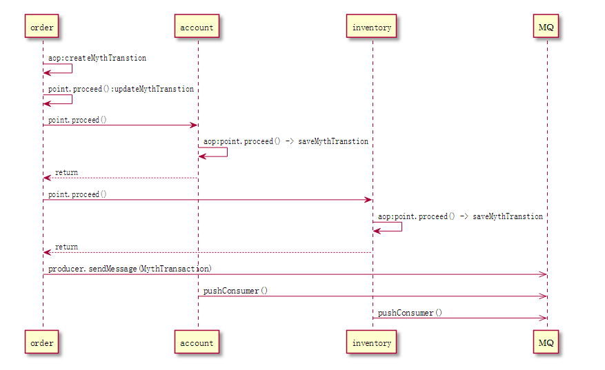
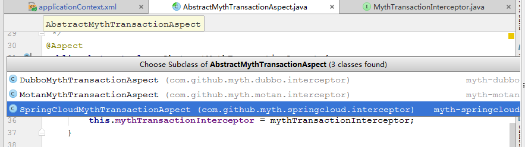
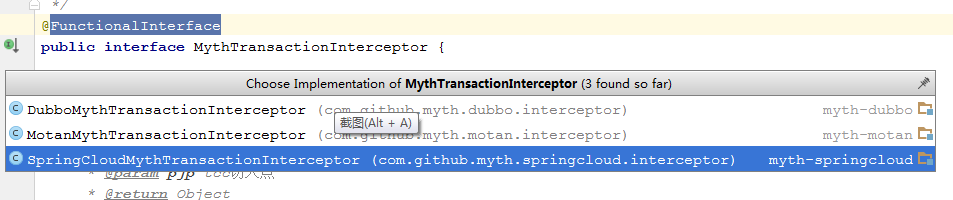

# Myth源码解析系列之（六）- 订单下单流程源码解析（发起者）
前面一章我们走完了服务启动的源码，这次我们进入下单流程的源码解析~

### 订单下单流程源码解析（发起者）
首先保证myth-demo-springcloud-order、myth-demo-springcloud-inventory、myth-demo-springcloud-eureka、myth-demo-springcloud-account 服务以正常启动


进入源码分析前，这里先给大家预热下，介绍下几个关键部分
1. 事务角色
```java
public enum MythRoleEnum {
    /**
     * Start myth role enum.
     * 这里主要为： orderServer
     */
    START(1, "发起者"),
    /**
     * Consumer myth role enum.
     */
    LOCAL(2, "本地执行"),
    /**
     * Provider myth role enum.
     * 这里主要为： accountServer, inventoryServer
     */
    PROVIDER(3, "提供者")
  }
```

2. 事务状态
```java

public enum MythStatusEnum {

    /**
     * Commit myth status enum.
     */
    COMMIT(1, "已经提交"),
    /**
     * Begin myth status enum.
     */
    BEGIN(2, "开始"),
    /**
     * Failure myth status enum.
     */
    FAILURE(4, "失败")
  }
  这里主要列了我们所使用的部分，没用的忽略
```
这个东西为什么在这里先讲，主要是为了让大家先了解下有这个东西，这样有助于后续代码理解 ~~  正所谓擒贼先擒王，抓住重点部位你就离成功不远鸟 O(∩_∩)O

时序图


订单下单接口入口：http://localhost:8884/swagger-ui.html


输入： 下单数量count: 1，  金额amount： 100 ，狠狠点   【Try it out!】,发起下单请求， 我们会进入<b>OrderController.orderPay</b>方法
```java
@PostMapping(value = "/orderPay")
@ApiOperation(value = "订单下单接口（注意这里模拟的是创建订单并进行下单扣减库存等操作）")
public String orderPay(@RequestParam(value = "count") Integer count,
                       @RequestParam(value = "amount") BigDecimal amount) {

    return orderService.orderPay(count, amount);

}

接着进入orderServiceImpl.orderPay 方法
@Override
    public String orderPay(Integer count, BigDecimal amount) {
        final Order order = buildOrder(count, amount);
        final int rows = orderMapper.save(order);

        if (rows > 0) {
            paymentService.makePayment(order);
        }


        return "success";
    }

```

这里我们发现封装了order对象然后进行了持久化操作，成功后，我们调用<b>paymentService.makePayment(order); </b> 重点来了，我们先来看下<b>paymentService.makePayment</b>方法体的代码

```java
    @Override
    @Myth(destination = "")
    public void makePayment(Order order) {


        //检查数据 这里只是demo 只是demo 只是demo

        final AccountDO accountDO =
                accountClient.findByUserId(order.getUserId());

        if(accountDO.getBalance().compareTo(order.getTotalAmount())<= 0){
            throw new MythRuntimeException("余额不足！");
        }

        final InventoryDO inventoryDO =
                inventoryClient.findByProductId(order.getProductId());

        if(inventoryDO.getTotalInventory() < order.getCount()){
            throw new MythRuntimeException("库存不足！");
        }

        order.setStatus(OrderStatusEnum.PAY_SUCCESS.getCode());
        orderMapper.update(order);
        //扣除用户余额
        AccountDTO accountDTO = new AccountDTO();
        accountDTO.setAmount(order.getTotalAmount());
        accountDTO.setUserId(order.getUserId());

        accountClient.payment(accountDTO);

        //进入扣减库存操作
        InventoryDTO inventoryDTO = new InventoryDTO();
        inventoryDTO.setCount(order.getCount());
        inventoryDTO.setProductId(order.getProductId());
        inventoryClient.decrease(inventoryDTO);
    }
```
方法具体业务我们暂且先不看，重点我们看下方法头部是不是有个<b>@Myth</b>注解，这就是实现分布式事务的关键，分布式事务主要通过<b>@Myth</b>注解来关联实现，这是基于aop切面思想，既然这样那么必定会有一个切入点，下面我们找到<b>myth-core工程AbstractMythTransactionAspect</b>类，原来这就是定义<b>@Myth</b>切入点的地方啊~

```java
@Aspect
public abstract class AbstractMythTransactionAspect {

    private MythTransactionInterceptor mythTransactionInterceptor;

    public void setMythTransactionInterceptor(MythTransactionInterceptor mythTransactionInterceptor) {
        this.mythTransactionInterceptor = mythTransactionInterceptor;
    }

    @Pointcut("@annotation(com.github.myth.annotation.Myth)")
    public void mythTransactionInterceptor() {

    }

    @Around("mythTransactionInterceptor()")
    public Object interceptCompensableMethod(ProceedingJoinPoint proceedingJoinPoint) throws Throwable {
        return mythTransactionInterceptor.interceptor(proceedingJoinPoint);
    }

    /**
     * spring Order 接口，该值的返回直接会影响springBean的加载顺序
     *
     * @return int 类型
     */
    public abstract int getOrder();
}
```
可以知道Spring实现类的方法凡是加了@Myth注解的，在调用的时候，都会进行 <b>mythTransactionInterceptor.interceptor </b>调用。也就是说一个请求链中，只要有标记该注解的业务方法，都会被加入到同一组分布式事务当中来，也就是说这么些个业务方法，要么全部执行成功，反之全部不执行~。

<b>AbstractMythTransactionAspect </b>是一个抽象类，下面我们看看它的实现

我们发现针对每种rpc都对应着有一个实现类，下面我们来看
```java
@Aspect
@Component
                                    public class SpringCloudMythTransactionAspect extends AbstractMythTransactionAspect implements Ordered {

    @Autowired
    public SpringCloudMythTransactionAspect(SpringCloudMythTransactionInterceptor springCloudMythTransactionInterceptor) {
        this.setMythTransactionInterceptor(springCloudMythTransactionInterceptor);
    }

    public void init() {
    }

    @Override
    public int getOrder() {
        return Ordered.HIGHEST_PRECEDENCE;
    }
}
```
我们注意到它实现了Spring的Ordered接口，并重写了 getOrder 方法，返回了 <b>Ordered.HIGHEST_PRECEDENCE</b> 那么可以知道，他是优先级最高的切面，这里<b>dubbo,motan</b>也是一样。 我们再来看<b>MythTransactionInterceptor
接口，也是类似，springcloud、dubbo、motan</b>都对应一个实现类

看完这里我们知道，我们知道此时代码不会直接进入<b>paymentService.makePayment</b>方法，而是先进入切面<b>SpringCloudMythTransactionInterceptor</b>，代码如下
```java
@Override
    public Object interceptor(ProceedingJoinPoint pjp) throws Throwable {
        MythTransactionContext mythTransactionContext = TransactionContextLocal.getInstance().get();
        if (Objects.nonNull(mythTransactionContext) &&
                mythTransactionContext.getRole() == MythRoleEnum.LOCAL.getCode()) {
            mythTransactionContext = TransactionContextLocal.getInstance().get();
        } else {
            RequestAttributes requestAttributes = RequestContextHolder.currentRequestAttributes();
            HttpServletRequest request = requestAttributes == null ? null : ((ServletRequestAttributes) requestAttributes).getRequest();
            String context = request == null ? null : request.getHeader(CommonConstant.MYTH_TRANSACTION_CONTEXT);
            if (StringUtils.isNoneBlank(context)) {
                mythTransactionContext =
                        GsonUtils.getInstance().fromJson(context, MythTransactionContext.class);
            }
        }
        return mythTransactionAspectService.invoke(mythTransactionContext, pjp);
    }
```
走到这里，因为第一次进来这些变量都没有值(按理说第一次一般都记忆深刻啊~~)，所以我们会直接进入<b>mythTransactionAspectService.invoke(mythTransactionContext, pjp)</b>， 此时<b>mythTransactionContext为null</b>，
接下来我们进入<b>MythTransactionAspectServiceImpl.invoke</b>方法
```java
public Object invoke(MythTransactionContext mythTransactionContext, ProceedingJoinPoint point) throws Throwable {
        final Class clazz = mythTransactionFactoryService.factoryOf(mythTransactionContext);
        final MythTransactionHandler mythTransactionHandler =
                (MythTransactionHandler) SpringBeanUtils.getInstance().getBean(clazz);
        return mythTransactionHandler.handler(point, mythTransactionContext);
    }
```
然后再进入MythTransactionFactoryServiceImpl.factoryOf
```java
/**
     * 返回 实现TxTransactionHandler类的名称
     *
     * @param context 事务上下文
     * @return Class<T>
     * @throws Throwable 抛出异常
     */
    @Override
    public Class factoryOf(MythTransactionContext context) throws Throwable {
        //如果事务还没开启或者 myth事务上下文是空， 那么应该进入发起调用
        if (!mythTransactionManager.isBegin() && Objects.isNull(context)) {
            return StartMythTransactionHandler.class;
        } else {
            if (context.getRole() == MythRoleEnum.LOCAL.getCode()) {
                return LocalMythTransactionHandler.class;
            }
            return ActorMythTransactionHandler.class;
        }
    }
```
重点来了，前面我们介绍了分布式事务角色，这里就是判断分布式事务角色的入口，根据判断我们进入发起者角色，也就是<b>StartMythTransactionHandler.handler</b>方法
```java
/**
     * Myth分布式事务处理接口
     *
     * @param point                  point 切点
     * @param mythTransactionContext myth事务上下文
     * @return Object
     * @throws Throwable 异常
     */
    @Override
    public Object handler(ProceedingJoinPoint point, MythTransactionContext mythTransactionContext) throws Throwable {
        try {
            //主要防止并发问题，对事务日志的写造成压力，加了锁进行处理
            try {
                LOCK.lock();
                mythTransactionManager.begin(point);
            } finally {
                LOCK.unlock();
            }
           return  point.proceed();
        } finally {
            //发送消息
            mythTransactionManager.sendMessage();
            mythTransactionManager.cleanThreadLocal();
            TransactionContextLocal.getInstance().remove();
        }
    }
```
接下来进入<b>mythTransactionManager.begin(point)</b>;
```java
public MythTransaction begin(ProceedingJoinPoint point) {
        LogUtil.debug(LOGGER, () -> "开始执行Myth分布式事务！start");
        MythTransaction mythTransaction = getCurrentTransaction();
        if (Objects.isNull(mythTransaction)) {

            MethodSignature signature = (MethodSignature) point.getSignature();
            Method method = signature.getMethod();

            Class<?> clazz = point.getTarget().getClass();

            mythTransaction = new MythTransaction();
            mythTransaction.setStatus(MythStatusEnum.BEGIN.getCode());
            mythTransaction.setRole(MythRoleEnum.START.getCode());
            mythTransaction.setTargetClass(clazz.getName());
            mythTransaction.setTargetMethod(method.getName());
        }
        //保存当前事务信息
        coordinatorCommand.execute(new CoordinatorAction(CoordinatorActionEnum.SAVE, mythTransaction));

        //当前事务保存到ThreadLocal
        CURRENT.set(mythTransaction);

        //设置myth事务上下文，这个类会传递给远端
        MythTransactionContext context = new MythTransactionContext();

        //设置事务id
        context.setTransId(mythTransaction.getTransId());

        //设置为发起者角色
        context.setRole(MythRoleEnum.START.getCode());

        TransactionContextLocal.getInstance().set(context);

        return mythTransaction;

    }
```
这个方法主要做两件事，首先封装分布式事务消息（MythTransaction）进行持久化（这里重点关注下<b>mythTransaction.setStatus(MythStatusEnum.BEGIN.getCode());</b>事务状态为开始，
<b>mythTransaction.setRole(MythRoleEnum.START.getCode());</b>事务角色为发起者，后续会用到），然后再设置<b>MythTransactionContext</b>事务上下文，这个主要用来传输给远端服务，这里远端服务可以理解为事务参与方。（注意这里两个消息对象都分别放到了ThreadLocal变量中）

关注下持久化操作是如何做的？
```java
//保存当前事务信息
        coordinatorCommand.execute(new CoordinatorAction(CoordinatorActionEnum.SAVE, mythTransaction));

//跟踪进去最后执行的是下面这段代码
        @Override
           public Boolean submit(CoordinatorAction coordinatorAction) {
               try {
                   QUEUE.put(coordinatorAction);
               } catch (InterruptedException e) {
                   e.printStackTrace();
                   return Boolean.FALSE;
               }
               return Boolean.TRUE;
           }

```
我们发现消息是发送给一个QUEUE队列，大家还记得之前讲服务启动源码解析，专门开了一个线程池任务来消费QUEUE队列做消息持久化操作，对的，消息就是在这里放进去的。

好了，到此我们begin方法已经走完， 下面会调用point.proceed();就正式进入到业务方法<b>paymentService.makePayment(order)</b>中，这个方法里主要也是做两件事，一个调用<b>Account</b>服务进行账户余额扣减，另一个调用<b>Inventory</b>服务进行库存扣减，这两个是通过调用接口来实现, 关键代码如下

```java
accountClient.payment(accountDTO);
//AccountClient.payment方法定义
  /**
    * 用户账户付款
    *
    * @param accountDO 实体类
    * @return true 成功
    */
   @PostMapping("/account-service/account/payment")
   @Myth(destination = "account", target = AccountService.class)
   Boolean payment(@RequestBody AccountDTO accountDO);

    inventoryClient.decrease(inventoryDTO);
//InventoryClient.decrease方法定义
/**
  * 库存扣减
  *
  * @param inventoryDTO 实体对象
  * @return true 成功
  */
@Myth(destination = "inventory",target = InventoryService.class)
@RequestMapping("/inventory-service/inventory/decrease")
Boolean decrease(@RequestBody InventoryDTO inventoryDTO);
```
注意到么，账户扣款和库存扣减方法都标记有<b>@Myth</b>注解，而另外两个查询方法是没有的。我们知道springAop的特性，在接口上加注解，是无法进入切面的，所以我们在这里，要采用rpc框架的某些特性来帮助我们获取到 <b>@Myth</b>注解信息, 这一步很重要。这里我们演示的是springcloud，所以进入<b>myth-springcloud</b>工程的<b>MythFeignHandler</b>类。（其中<b>dubbo，与motan</b>这部分实现分别对应：<b>DubboMythTransactionFilter 和 MotanMythTransactionFilter</b> 类， 都是通过框架自身过滤器特性来实现， 逻辑与springcloud一样，只是实现上有少许差别~ 童鞋们一看便知，这里不再赘述~）

```java
public Object invoke(Object proxy, Method method, Object[] args) throws Throwable {
        if (Object.class.equals(method.getDeclaringClass())) {
            return method.invoke(this, args);
        } else {

            final Myth myth = method.getAnnotation(Myth.class);
            if (Objects.isNull(myth)) {
                return this.handlers.get(method).invoke(args);
            }
            try {
                final MythTransactionManager mythTransactionManager =
                        SpringBeanUtils.getInstance().getBean(MythTransactionManager.class);

                final MythParticipant participant = buildParticipant(myth, method, args);
                if (Objects.nonNull(participant)) {
                    mythTransactionManager.registerParticipant(participant);
                }
                return this.handlers.get(method).invoke(args);
            } catch (Throwable throwable) {
                throwable.printStackTrace();
                return new Object();
            }


        }
    }


    private MythParticipant buildParticipant(Myth myth, Method method, Object[] args) {

        final MythTransactionContext mythTransactionContext =
                TransactionContextLocal.getInstance().get();
        MythParticipant participant;
        if (Objects.nonNull(mythTransactionContext)) {

            final Class declaringClass = myth.target();

            MythInvocation mythInvocation = new MythInvocation(declaringClass,
                    method.getName(),
                    method.getParameterTypes(), args);

            final Integer pattern = myth.pattern().getCode();

            //封装调用点
            participant = new MythParticipant(
                    mythTransactionContext.getTransId(),
                    myth.destination(),
                    pattern,
                    mythInvocation);

            return participant;
        }
        return null;
    }
```
从源码得知，只有方法上打了@Myth注解的才会进入后续逻辑，否则直接执行返回，我们详细看下<b>buildParticipant(myth, method, args);</b>方法，首先从<b>TransactionContextLocal.getInstance().get()</b>获取事务上下文对象<b>MythTransactionContext</b>，这里有值吗？ 是的因为前面我们已经设置值了，所以这里能拿到值，这里大家注意下<b>destination,target</b>这两个属性， destination这是就是消息中间件使用的队列名称，不同服务定义不同队列来发送消息，target为目标业务calss,获取到相关值后对MythParticipant进行封装并返回，接下来我们继续往下走，进入<b>MythTransactionManager.registerParticipant</b>
```java
public void registerParticipant(MythParticipant participant) {
       final MythTransaction transaction = this.getCurrentTransaction();
       transaction.registerParticipant(participant);
       coordinatorService.updateParticipant(transaction);
}
```
我们发现这里其实就是对前面<b>MythTransaction</b>持久化的一个更新操作，主要更新调用其他子系统接口需要执行的class，method等信息，这个消息后面会通过mq进行投递，其他子系统通过消费来进行本地执行。

好了，到此我们已经走完了发起者大部分了，紧接着就是调用执行account,Inventory服务了，也就是参与者部分，这里我们发现还有finally快部分代码未走完， 稍稍休息下，详情请见下回分解~~

<b>大家有任何问题或者建议欢迎沟通 ，欢迎加入QQ群：162614487 进行交流</b>
