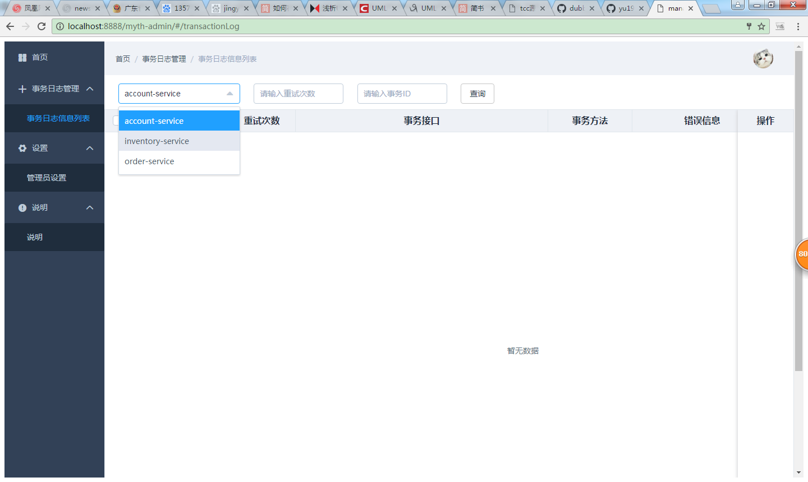

# Myth源码解析系列之（八）结尾篇- myth-admin事务管理后台
分布式事务的跟踪管理后台

##1、配置详解
```java

server.port=8888
server.context-path=/myth-admin
server.address=0.0.0.0
spring.application.name=myth-admin


#激活方式 指的是存储事务日志采取的方式 同业务模块一样
spring.profiles.active=db


# myth 管理后台用户名
myth.admin.userName=admin

# myth 管理后台密码
myth.admin.password=admin


# 各项目的事务日志存储路径的后缀，这里一定需要指定
myth.repository.suffix.list=account-service,inventory-service,order-service


# 各项目支持的序列化方式 每个项目需要配置成一样的
myth.serializer.support=kryo

myth.retry.max=10

#dbSuport
myth.db.driver=com.mysql.jdbc.Driver
myth.db.url=jdbc:mysql://localhost:3306/myth?useUnicode=true&amp;characterEncoding=utf8
myth.db.username=root
myth.db.password=123456

#redis
myth.redis.cluster=false
myth.redis.hostName=localhost
myth.redis.port=6379
myth.redis.password=
#myth.redis.clusterUrl=127.0.0.1:70001;127.0.1:7002

#mongo
myth.mongo.url=localhost:27017
myth.mongo.dbName=happylife
#myth.mongo.userName=xiaoyu
myth.mongo.password=123456

#zookeeper
myth.zookeeper.host=192.168.156.101:2181
myth.zookeeper.sessionTimeOut=200000
```

## 2、修改本项目static 文件夹下的 index.html
```html
<!--href 修改成你的ip 端口-->
<a id="serverIpAddress" style="display: none" href="http://172.16.104.14:8888/myth-admin">
```

##  3、运行 MythAdminApplication 中的main方法。

##  4、浏览器访问 http://ip:prot/myth-admin/index.html ,输入用户名，密码登录



<b>大家有任何问题或者建议欢迎沟通 ，欢迎加入QQ群：162614487 进行交流</b>
